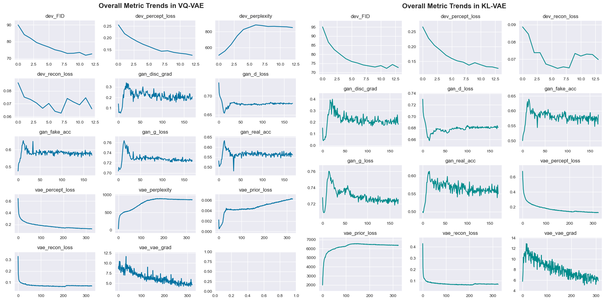

# image-diffusion
My implementation of latent diffusion model trained from scratch to generate small pictures of landscapes.

## The dataset
The dataset used was [LHQ (Landscapes High-Quality)](https://paperswithcode.com/dataset/lhq) with 90,000 landscapes. Due to computational restrictions (Google Colab's free T4) the pictures were resized to 128x128 resolution. Train dataset consisted of 81,000 samples and dev set of 9,000 samples.

## The overall approach
Training was divided into two parts: (1) training an autoencoder with discriminator to compress images from pixel space of shape 128x128x3 into 32x32x3 latent space. This approach was similar to training a VQGAN. And (2) training a Unet diffusion prior on compressed image representations.

### Autoencoders
Two autoencoders were trained. The first one with quantized latent space (VQ-VAE; ~36M params) which consisted of 1024 entries updated via exponential moving average, with over 83% codebook utilization on dev set measured by perplexity. The descriminator was turned on after first 13,000 steps and the training continued until 22,000 steps with batch size of 48. 

The second autoencoder was trained with KL-regularized latent space (KL-VAE; ~36M params). A small penalty was applied to keep latents somewhat close to a shape of a normal distribution. The discriminator was turned on after 15,000 steps and the model trained until almost 24,000 steps with batch size of 48. I also noticed that it is rare to upload how metrics (eg. loss, gradients) change during training, which may be helpful for others to examine and detect potential instabilities during training their own models, so below I placed metrics from both VQ-VAE and KL-VAE training runs.

The quality of reconstruction was measured using Frechet Inception DIstance (FID) and for both models it was almost the same; VQ-VAE with FID ~74 and for the KL-VAE with FID ~72. Images were compressed with the ratio of 4, but when I tried compressing them by a factor of 8 the results were much worse (a more powerful autoencoder was needed). Below are some of the first stage reconstructions from the dev set.

Second stage comming soon...
