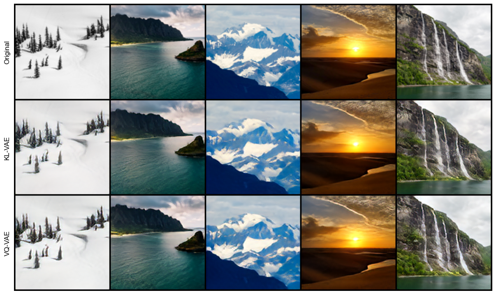

# image-diffusion
My implementation of diffusion model trained to generate landscapes.

# The Dataset
The dataset used was [LHQ (Landscapes High-Quality)](https://paperswithcode.com/dataset/lhq) with 90,000 landscapes. Due to computational restrictions (Google Colab's free T4) the picturees were resized to 128x128 resolution. 

## The Model
Training was divided into two parts: (1) Training a VQGAN to compress images into 32x32x3 latent space and (2) training a Unet diffusion prior on compressed images. Lantent space consisted of 1024 different entries update via exponential moving average. Codebook usage on dev set with 9,000 samples was over 60%, which was measured by perplexity. Below are some of the first stage reconstructions from the dev set.

Second stage comming soon...