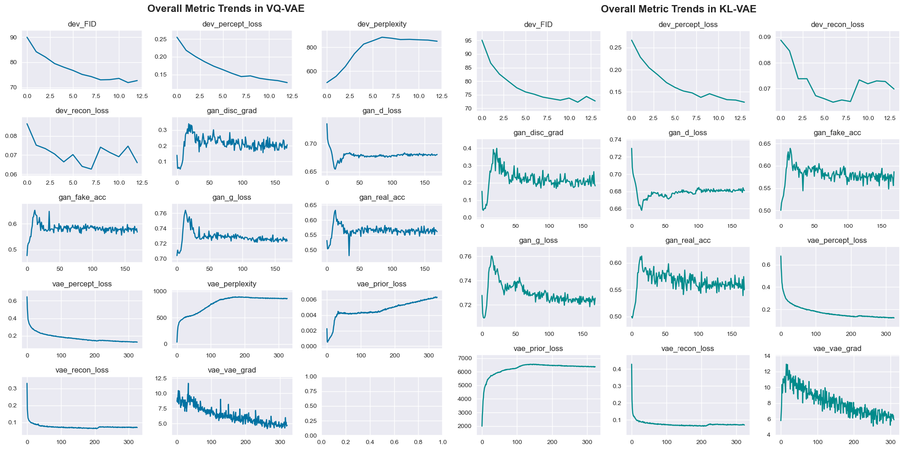
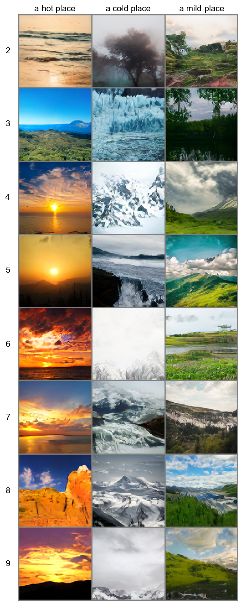
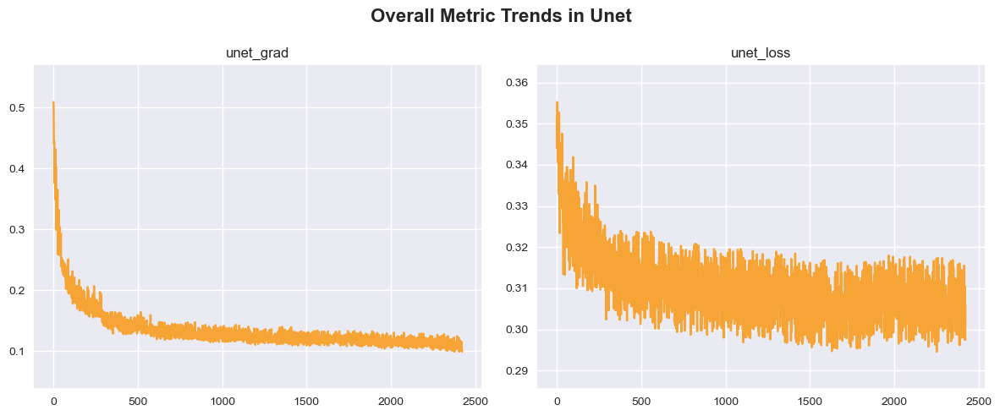

# image-diffusion
My implementation of latent diffusion model trained from scratch to generate small pictures of landscapes. This repo probably contains too much voodoo, but it's for educational purposes only ¯\\\_(ツ)_/¯
  

## The dataset
The dataset used was [LHQ (Landscapes High-Quality)](https://paperswithcode.com/dataset/lhq) with 90,000 landscapes. Due to computational restrictions (Google Colab's free T4) the pictures were resized to 128x128 resolution. Train dataset consisted of 81,000 samples and dev set of 9,000 samples.
  

## The overall approach
Training was divided into two parts: (1) training an autoencoder with discriminator to compress images from pixel space of shape 128x128x3 into 32x32x3 latent space. This approach was similar to training a VQGAN. And (2) training a Unet diffusion prior on compressed image representations.

### Autoencoders (stage 1)
Two autoencoders were trained. The first one with quantized latent space (VQ-VAE; ~36M params) which consisted of 1024 entries updated via exponential moving average, with over 83% codebook utilization on dev set measured by perplexity. The descriminator was turned on after first 13,000 steps and the training continued until 22,000 steps with batch size of 48. 

The second autoencoder was trained with KL-regularized latent space (KL-VAE; ~36M params). A small penalty was applied to keep latents somewhat close to a shape of a normal distribution. The discriminator was turned on after 15,000 steps and the model trained until almost 24,000 steps with batch size of 48. I also noticed that it is rare to upload how metrics (eg. loss, gradients) change during training, which may be helpful for others to examine and detect potential instabilities during training their own models, so below on figure 2, I placed metrics from both VQ-VAE and KL-VAE training runs.

The quality of reconstruction was measured using Frechet Inception DIstance (FID) and for both models it was almost the same; VQ-VAE with FID ~74 and for the KL-VAE with FID ~72. Images were compressed with the ratio of 4, but when I tried compressing them by a factor of 8 the results were much worse (a more powerful autoencoder was needed). Figure 1 represents some of the first stage reconstructions from the dev set.
  

Figure 1. First stage reconstructions of the autoencoders.

 

Figure 2. First stage training metrics. There is something wrong with gradients in both training runs, but I was unable to find the cause of the problem.
 

### Latent Diffusion (stage 2)
In the second stage a latent diffusion model (Unet; ~66M params) was trained on extracted image representations, but due to compute restrictions only for the KL model. Extracted KL latents had a shape somewhat close to normal distribution with mean 0.02 and std of 0.94. Latents were denoised in batches of 48 for ~220,000 training steps. Standard linear noise schedule was applied (0.0001 - 0.02 in 1000 steps). Training metrics for stage 2 are on figure 4.

To condition model on some information I decided to use classifier-free guidance. I used [OpenAI's CLIP](https://openai.com/index/clip/) model to divide images into classes. At first I tried to extract 7 classes (a coast, a desert, a forest, a sky, a mountain, a body of water, a grassland) but there was a great disproportion and the [model struggled](figures/stage2-7classes.png) to generate under-represent classes such as a coast or a forest. In my second attempt I divided places into 3 classes, with more or less equal cardinality, by asking the model to choose whether an image represents a hot place, a cold place or a mild place. 

The results of trained Unet model are presented on figure 3. The model was small so the quality is OK but not great. Unfortunately I was not able to compute the FID score as generating a grid of 27 images takes ~12 minutes on my GPU (and I was too lazy to do it using Google Colab)
  

 
Figure 3. Second stage image generations of the KL model. Quality of the image depends on the cfg scale (numbers on the right).

 

Figure 4. Second stage training metric for the KL model. Loss quickly saturates but according to varius sources image quality is still improving.